# PegasusAgent — Architecture Reference

> Auto-healing agent for Pegasus WMS / HTCondor workflows.
> Triggered by DAGMan as a POST script on every job exit.
> No API server required — runs entirely in-process.

---

## System Architecture

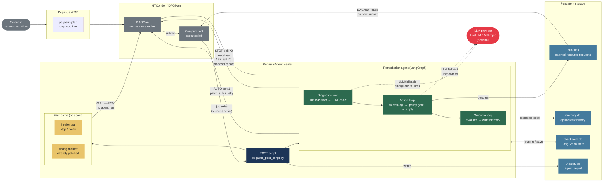

---

## Table of Contents

1. [System Overview](#1-system-overview)
2. [POST Script — Entry Point](#2-post-script--entry-point)
3. [Evidence Collection](#3-evidence-collection)
4. [The Two-Loop LangGraph](#4-the-two-loop-langgraph)
5. [Diagnostic Loop](#5-diagnostic-loop)
   - [Rule Classifier](#51-rule-classifier)
   - [LLM Diagnosis Agent (ReAct)](#52-llm-diagnosis-agent-react)
6. [Action Loop](#6-action-loop)
   - [Fix Catalog](#61-fix-catalog)
   - [LLM Fix Planner](#62-llm-fix-planner)
   - [Policy Engine](#63-policy-engine)
   - [Apply Fix + Sibling Broadcast](#64-apply-fix--sibling-broadcast)
7. [Thread & Checkpoint System](#7-thread--checkpoint-system)
8. [Memory System](#8-memory-system)
9. [Sub File Patching](#9-sub-file-patching)
10. [Exit Code Contract](#10-exit-code-contract)
11. [Demo Workflows](#11-demo-workflows)
12. [Known Limitations](#12-known-limitations)

---

## 1. System Overview

```
Pegasus WMS plans a DAG → HTCondor executes jobs → job fails
                                                          │
                                           DAGMan calls POST script
                                                          │
                                           pegasus_post_script.py
                                                          │
                                    ┌─────────────────────┴──────────────────────┐
                                    │         LangGraph remediation graph         │
                                    │  collect → classify → fix → apply → retry  │
                                    └─────────────────────┬──────────────────────┘
                                                          │
                          ┌───────────────────────────────┼───────────────────────┐
                          │                               │                       │
                    exit 1 (AUTO)                   exit 0 (ASK)           exit 0 (STOP)
                    DAGMan retries             proposal written           workflow ends
                    patched .sub              human applies fix
```

**Key design decisions:**

| Decision | Rationale |
|---|---|
| POST script, not daemon | No server to maintain; DAGMan manages lifecycle |
| In-process LangGraph | No IPC, no network; graph state in SQLite checkpoint |
| Rules-first, LLM-fallback | Fast + cheap for known failures; LLM only for ambiguous ones |
| Deterministic policy gate | LLM can never auto-apply forbidden actions regardless of output |
| Sibling broadcast | One agent run fixes the whole parallel family |

---

## 2. POST Script — Entry Point

**File:** `scripts/pegasus_post_script.py`

DAGMan calls this script after every job exits (success or failure).

### Invocation signature

```
python pegasus_post_script.py $RETURN $JOB $RETRY $MAX_RETRIES <submit_dir> <wf_uuid>
```

DAGMan substitutes `$RETURN` (exit code), `$JOB` (job name), `$RETRY` (retry count) at runtime.

### Execution flow

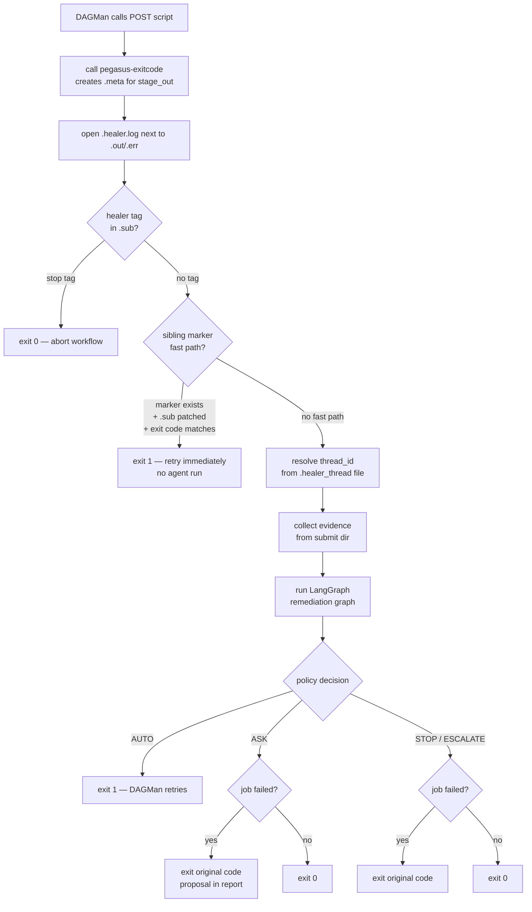

### Key functions

| Function | Responsibility |
|---|---|
| `_call_pegasus_exitcode()` | Runs `/usr/bin/pegasus-exitcode job.out` to create `.meta` checksum files that stage_out requires |
| `_find_job_subdir()` | Locates the `00/00/` subdirectory containing the job's `.sub` file |
| `_open_log()` | Opens `{job_id}.healer.log` next to `.out/.err` for persistent tracing |
| `_resolve_thread()` | Returns `(thread_id, is_resume)` — thread_id = `{wf_uuid}/{job_id}/{instance_id}` |
| `_marker_fast_path()` | Checks if sibling broadcast already fixed this job — skips agent entirely |
| `_run()` | Async: collects evidence, builds services, invokes graph, returns exit code |

### Files written next to `.out` / `.err`

```
00/00/
  compute_compute_A.out          ← HTCondor/kickstart output
  compute_compute_A.err          ← HTCondor stderr
  compute_compute_A.healer.log   ← healer trace (every invocation appended)
  compute_compute_A.healer_thread← thread_id for LangGraph checkpoint resume
  compute_compute_A.agent_report ← structured JSON report (diagnosis + fix)
  compute_compute_A.meta         ← created by pegasus-exitcode (output checksums)
```

---

## 3. Evidence Collection

**File:** `app/utils/collectors/submit_dir.py`

Called synchronously before the graph runs. Reads all diagnostic files from the submit directory and returns a `RawEvidence` model.

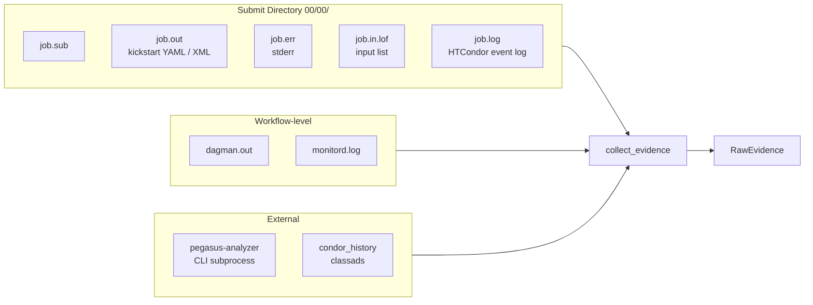

**Available sources** (reported in healer log):
- `pegasus_analyzer` — structured failure summary from `pegasus-analyzer`
- `stderr` — raw stderr content (up to 200 KB)
- `stdout_kickstart` — kickstart `.out` file with timing and exit codes
- `submit_file` — HTCondor `.sub` file (resource requests, tags)
- `dagman_log` — DAGMan `.out` for retry history
- `transformation_script` — the actual executable script

In `collect_context` node, `RawEvidence` enriches `FailureContext` with:
- `job_tags` — from `+PegasusHealerTags` in `.sub`
- `stderr_excerpt` — last 3000 chars of stderr (for rule classifier pattern matching)
- `requested_resources` — from `.sub` (not condor_history, which has pre-patch values)
- `transformation` — parsed from executable path in `.sub`

### Kickstart output format

Pegasus 5.x writes the `.out` file in **YAML** format; Pegasus 4.x used XML `<invocation>` elements. The agent handles both automatically.

**YAML structure (Pegasus 5.x):**

```yaml
- invocation: True
  mainjob:
    usage:
      maxrss: 262144      # KB — peak RSS → peak_memory_mb
      utime: 1.23         # user CPU time
      stime: 0.45         # system CPU time
    status:
      regular_exitcode: 0          # normal exit
      # or: signal_number: 9       # SIGKILL → exit_signal + exit_code 137
    duration: 294.0                # wall time in seconds
  files:
    filename.gz:
      error: 2                     # non-zero → transfer failure
  stderr:
    data: |                        # ← full application stderr embedded here
      INFO: Reading URL pairs...
      ERROR: Transfer failed
      Killed
  stdout:
    size: 0
    data: |                        # ← full application stdout (if any)
      ...
```

The `stderr.data` block is the **primary diagnostic source** for transfer failures, application crashes, and OOM kills — more complete than the `.err` file, which often only contains HTCondor bookkeeping. `get_kickstart_data` extracts both `stderr_data` and `stdout_data`. `get_stderr` falls back to `stderr_data` from the YAML automatically when the `.err` file is empty.

---

## 4. The Two-Loop LangGraph

**File:** `app/graph/graph.py`

The graph has two loops connected through `evaluate_outcome`:

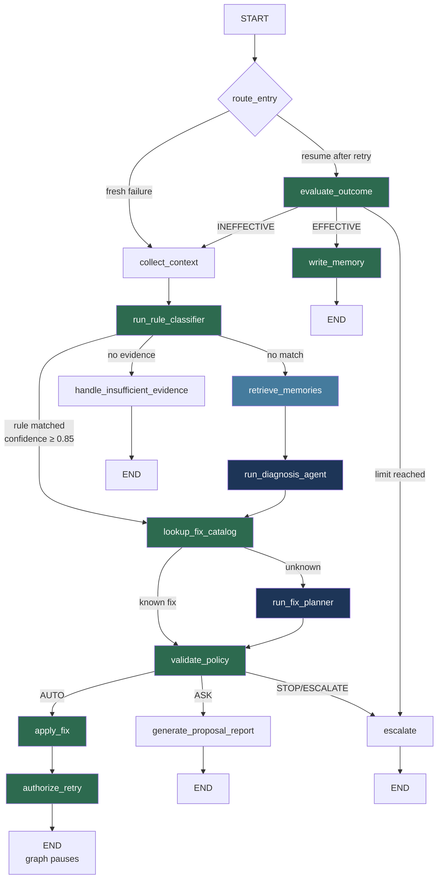

**Green nodes** — deterministic, no LLM
**Blue nodes** — LLM-powered
**Teal nodes** — memory / retrieval

### State keys

| Key | Set by | Used by |
|---|---|---|
| `incident_id` | POST script | all nodes |
| `job_id`, `workflow_id` | POST script | collect_context |
| `exit_code` | POST script | rule classifier |
| `context` | collect_context | all diagnostic nodes |
| `raw_evidence` | collect_context | diagnosis agent, fix planner |
| `diagnosis` | rule_classifier / diagnosis_agent | lookup_fix_catalog, apply_fix |
| `proposed_fix` | fix_catalog / fix_planner | validate_policy, apply_fix |
| `policy_decision` | validate_policy | graph router, POST script |
| `overlay` | apply_fix | (logged) |
| `retry_job_instance_id` | authorize_retry | graph resume signal |
| `retry_outcome` | POST script (invocation 2+) | evaluate_outcome |
| `retrieved_memories` | retrieve_memories | run_diagnosis_agent |

---

## 5. Diagnostic Loop

### 5.1 Rule Classifier

**File:** `app/utils/rules/classifier.py`

Pure Python — no LLM, no I/O. Runs first, every time. Returns a `Diagnosis` or `None`.

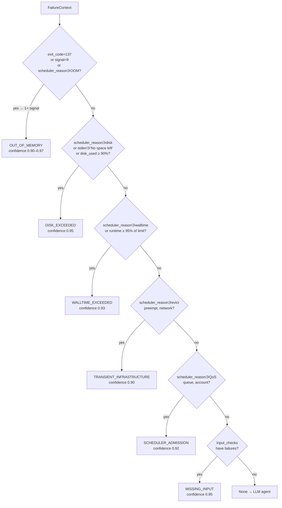

**Signal sets used:**

| Failure type | Signals checked |
|---|---|
| OUT_OF_MEMORY | exit 137, signal 9, scheduler hold reason, peak_memory ≥ 85% of request |
| DISK_EXCEEDED | scheduler hold reason, stderr patterns (`No space left`, `ENOSPC`, `disk full`), disk_used ≥ 90% |
| WALLTIME_EXCEEDED | scheduler hold reason, runtime ≥ 95% of request |
| TRANSIENT | scheduler reason (evict, preempt, node fail, network, disconnected) |
| SCHEDULER_ADMISSION | scheduler reason (QoS, invalid queue, account, over limit) |
| MISSING_INPUT | input_checks list (populated by ContextCollector) |

### 5.2 LLM Diagnosis Agent (ReAct)

**File:** `app/agents/diagnosis.py`

Only invoked when no rule matched. Implements a ReAct (Reason + Act) loop.

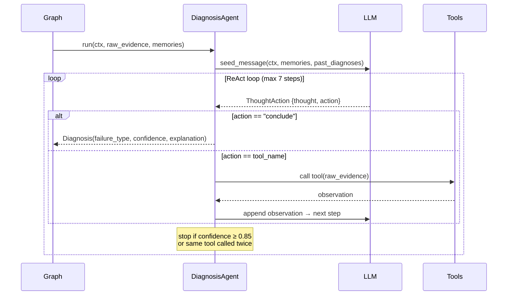

**Available tools:**

| Tool | Returns |
|---|---|
| `parse_failure_summary` | pegasus-analyzer structured output |
| `get_stderr` | stderr content — from `.err` file, or falls back to `stderr_data` embedded in kickstart YAML when `.err` is empty |
| `get_kickstart_data` | timing, exit codes, resource usage from kickstart YAML or XML; critically includes `stderr_data` / `stdout_data` (full app output captured by kickstart) and `file_errors` (transfer error codes per file) |
| `get_stdout` | application stdout captured by kickstart (`stdout.data` in YAML, `<stdout>` in XML) |
| `get_resource_requests` | current `.sub` resource values |
| `get_condor_history` | HTCondor classads (memory, disk, runtime used) |
| `get_event_log` | HTCondor event log (evictions, holds, checkpoints) |
| `get_dagman_log` | DAGMan retry history |
| `get_transformation_script` | source of the executable |
| `get_input_validation` | checks which input files exist and are accessible |

**Seed message** contains:
- Job identity and exit code
- Available data sources
- Past diagnoses (same incident, prior attempts)
- Similar past incidents from memory (`retrieved_memories`)

**Stopping conditions:**
1. `action == "conclude"` — LLM decided it has enough evidence
2. `confidence ≥ 0.85` in thought — next step forced to conclude
3. Same tool called twice — force conclude to avoid loops
4. `MAX_STEPS = 7` reached — force conclude with lower confidence

---

## 6. Action Loop

### 6.1 Fix Catalog

**File:** `app/utils/fixes/catalog.py`

Deterministic lookup — no LLM. Maps `FailureType` → `FixProposal` using policy multipliers.

| Failure type | Action | Formula | Auto? |
|---|---|---|---|
| OUT_OF_MEMORY | INCREASE_MEMORY | `ceil(current × 1.5)`, max 512 GB | AUTO |
| DISK_EXCEEDED | INCREASE_DISK | `ceil(current × 2.0)`, max 1 TB | AUTO |
| WALLTIME_EXCEEDED | INCREASE_RUNTIME | `int(current × 1.5)`, max 48 h | ASK |
| TRANSIENT_INFRASTRUCTURE | NO_ACTION_TRANSIENT_RETRY | — | AUTO |
| MISSING_INPUT | CORRECT_DATA_BINDING | — | ASK |

Returns `None` for `APPLICATION_ERROR`, `LOGIC_VALIDATION`, `UNKNOWN` → routes to LLM Fix Planner.

### 6.2 LLM Fix Planner

**File:** `app/agents/fix_planning.py`

Called only when the catalog has no entry. Given the diagnosis and raw evidence, proposes a `FixProposal` with `script_patches` or configuration changes.

### 6.3 Policy Engine

**File:** `app/utils/policies/engine.py`
**Config:** `policies/remediation.yaml`

Deterministic safety gate. Runs after every fix proposal — catalog or LLM. **LLM output can never override policy.**

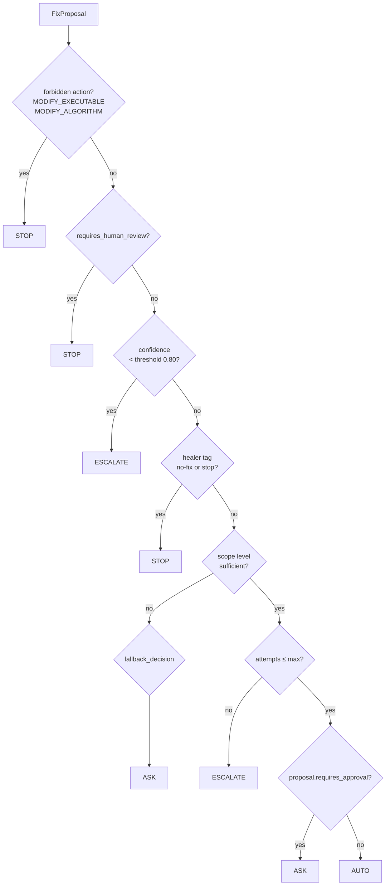

**Scope levels** (from `remediation.yaml`):

```
job      → submit dir only (.sub, .dag)         current default
script   → job + transformation scripts
catalog  → script + replica/transformation catalogs
workflow → catalog + DAX / pegasus.properties
```

**Healer tags** (set per-job in workflow YAML → appear in `.sub`):

| Tag | Effect |
|---|---|
| `no-fix` | Diagnose only — never apply or propose a fix |
| `stop` | Abort entire workflow on failure |
| `stop-jobs` | Stop all jobs of the same transformation family |

### 6.4 Apply Fix + Sibling Broadcast

**Files:** `app/graph/nodes.py` → `apply_fix`, `app/utils/pegasus/sibling_fixer.py`

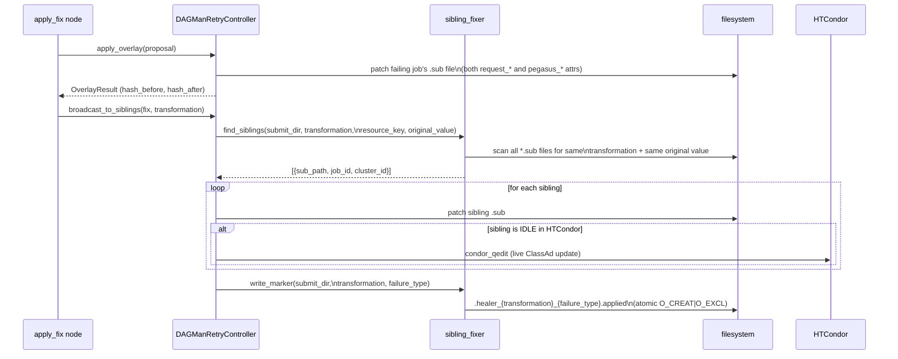

**Sibling states and actions:**

| HTCondor state | Action |
|---|---|
| IDLE (queued) | Patch `.sub` + `condor_qedit` — updates live ClassAd, job runs with new resources |
| RUNNING | Patch `.sub` only — if it fails, retry uses new values |
| NOT_SUBMITTED | Patch `.sub` only — DAGMan reads patched file on submission |
| FAILED / HELD | Skip — handled by their own POST script invocation |

**Marker fast path** — when a sibling already had its `.sub` patched but ran with old ClassAd:

```
marker file exists
  AND this job's .sub already has the patched value
  AND current exit code matches the failure type's known codes
  ──→ skip entire agent run ──→ exit 1 (retry with patched .sub)
```

---

## 7. Thread & Checkpoint System

**Invocation 1** (first failure, `$RETRY=0`):

```
thread_id = "{workflow_uuid}/{job_id}/{instance_id}"
.healer_thread file written → fresh thread
graph runs: collect → classify → fix → apply → authorize_retry → END
```

**Invocation 2+** (retried job exits, `$RETRY=1`):

```
thread_id read from .healer_thread → is_resume=True
graph resumes from checkpoint: input = {retry_outcome: EFFECTIVE|INEFFECTIVE}
route_entry → evaluate_outcome → write_memory → END
```

The **SQLite checkpointer** (`~/.pegasus_healer_checkpoint.db`) stores the full graph state between invocations. Override with `HEALER_CHECKPOINT` env var.

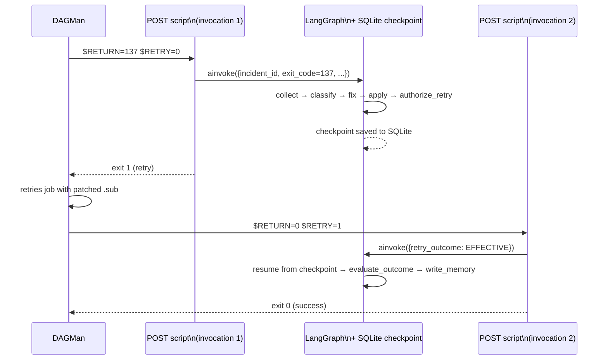

---

## 8. Memory System

**File:** `app/utils/memory/sqlite_repo.py`

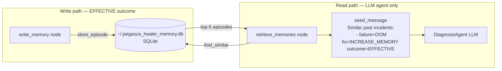

**Episode schema stored:**

```
failure_type       TEXT    e.g. OUT_OF_MEMORY
transformation     TEXT    e.g. compute
execution_site     TEXT    e.g. local
fix_action         TEXT    e.g. INCREASE_MEMORY
outcome            TEXT    EFFECTIVE
config_delta       JSON    {"memory_mb": 384}
confidence         REAL    0.97
occurrence_count   INT     1  (incremented on duplicates)
```

**When retrieve_memories is called:**
Only on the LLM-agent path — when `run_rule_classifier` returns no match. For `OUT_OF_MEMORY`, `DISK_EXCEEDED`, `WALLTIME_EXCEEDED` the rule classifier always fires first (confidence ≥ 0.90), so memory retrieval is **skipped** for these common cases.

**Current limitations:**

| Limitation | Impact |
|---|---|
| `project_id = workflow_id` (UUID) | Episodes from `run0001` never found in `run0002` — memory is write-only cross-run |
| Exact-match SQL (`WHERE project_id=?`) | No semantic similarity — structurally identical failures with different field values return 0 results |
| No embedding / vector search | Cannot find "similar" failures across transformations |

---

## 9. Sub File Patching

**File:** `app/utils/pegasus/sub_file.py`

Pegasus `.sub` files use two parallel attributes for resource requests. Patching only one breaks on retry because the template re-expands:

```
# HTCondor scheduling          # Pegasus metadata
request_memory = 256    ←──→  pegasus_memory_mb = 256
request_disk   = 512    ←──→  pegasus_diskspace_mb = 512
request_cpus   = 1      ←──→  pegasus_cores = 1
+MaxRuntime    = 3600   ←──→  pegasus_job_runtime = 3600
```

The patcher updates **both** columns atomically. If an attribute is absent, it is inserted before the final `queue` statement.

**Example — OOM fix on compute job (256 → 384 MB):**

```diff
- request_memory          = 256
- pegasus_memory_mb       = 256
+ request_memory          = 384
+ pegasus_memory_mb       = 384
```

---

## 10. Exit Code Contract

| Condition | POST script exits | DAGMan action |
|---|---|---|
| AUTO fix applied | 1 | Retry job with patched `.sub` |
| Sibling fast path | 1 | Retry job with already-patched `.sub` |
| ASK — job failed | original exit code (non-zero) | Mark node FAILED (prevents stage_out) |
| ASK — job succeeded | 0 | Continue workflow |
| STOP / ESCALATE — job failed | original exit code | Mark node FAILED |
| STOP / ESCALATE — job succeeded | 0 | Continue workflow |
| EFFECTIVE outcome on resume | 0 | Continue workflow |
| Healer tag `stop` | 0 | Workflow aborts |

**Why ASK exits with original code when job failed:**
Exiting 0 would make DAGMan mark the node DONE → `stage_out` runs → looks for `.meta` file → fails because job never produced output. Preserving the non-zero exit code keeps the node in FAILED state and prevents downstream jobs from running against non-existent outputs.

---

## 11. Demo Workflows

### hello-world-demo

Baseline end-to-end test.

```
hello (request_memory=256, exits 137 on attempt 0)
  → healer: OUT_OF_MEMORY → INCREASE_MEMORY → 256→384 MB → retry
  → hello succeeds → world runs → stage_out → SUCCESS
```

### disk-demo (`workflows/disk_demo.py`)

```
analyze (request_disk=512 MB, stderr: "No space left on device")
  → healer: DISK_EXCEEDED → INCREASE_DISK → 512→1024 MB → retry
  → analyze succeeds → report runs → SUCCESS
```

### sibling-demo (`workflows/sibling_demo.py`)

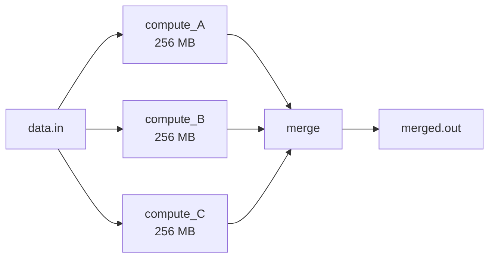

All three `compute` jobs fail with exit 137. Healer detects OOM on each, patches all three `.sub` files (sibling broadcast), writes marker. On next run sibling fast path fires for jobs whose marker was written before they failed.

---

## 12. Known Limitations

| Area | Limitation | Planned fix |
|---|---|---|
| Memory retrieval | `project_id = workflow_uuid` — cross-run lookup always returns empty | Use stable workflow name as project_id |
| Memory retrieval | Exact SQL match, no semantic similarity | Embedding column + cosine similarity |
| retrieve_memories | Skipped entirely when rules match (OOM/DISK/WALLTIME) | Intentional — fast path; memory matters for LLM path only |
| Sibling fast path | Race condition when all siblings fail simultaneously → all run full agent | Add DAGMan PRIORITY ordering to stagger starts |
| Sub file patching | Only patches `request_*` and `pegasus_*` — custom submit attributes untouched | Extend `_ATTR_MAP` as needed |
| Policy scope | Default `level: job` — script/catalog/workflow fixes always produce ASK | Raise scope level in `remediation.yaml` when trust is established |
| Embedding model | No embedding configured → retrieve_memories returns exact-match SQL only | Set `EMBED_MODEL` / `EMBED_API_KEY` env vars when adding semantic search |
| ASK decision | In automated POST script context ASK = STOP (no notification channel, no approval UI) | Replace ASK with human-approval webhook or remove from automated path |
